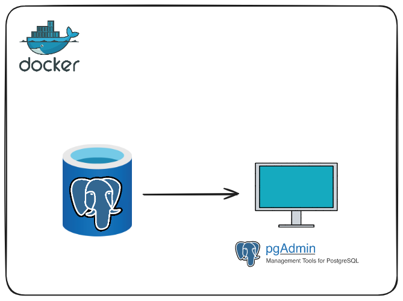

[](LICENSE)

# B&T: Optimizacion SQL

Este repositorio contiene los archivos necesarios para levantar un entorno de desarrollo local utilizando Docker para PostgreSQL y PgAdmin. Posteriormente se realizaran una serie de consultas SQL con técnicas para su optimizacion. Sigue las instrucciones a continuación para configurar y acceder al entorno.

## Tabla de Contenidos

- [Servicio PostgreSQL y PgAdmin en Docker](#servicio-postgresql-y-pgadmin-en-docker)
  - [Docker](#docker)
  - [Diagrama del Proyecto](#diagrama-del-proyecto)
  - [Levantando el Entorno](#levantando-el-entorno)
    - [Prerequisitos](#prerequisitos)
    - [Instalación](#instalación)
  - [Configuración de PgAdmin](#configuración-de-pgadmin)
- [Optimización de SQL](#optimización-de-sql)
  - [Ejecutando Consultas](#ejecutando-consultas)
  - [Índices](#índices)
  - [Joins](#joins)
  - [Prefiltrado en Joins](#prefiltrado-en-joins)
  - [Funciones Analíticas](#funciones-analíticas)
- [Tecnologías Utilizadas](#tecnologías-utilizadas)
- [Licencia](#licencia)
- [Contacto](#contacto)

## Servicio PostgreSQL y PgAdmin en Docker

### Docker

Docker es una plataforma que permite crear y administrar contenedores, que son máquinas virtuales basadas en imágenes en un entorno aislado. Los contenedores proporcionan un entorno consistente y reproducible para ejecutar aplicaciones.

### Diagrama del Proyecto



### Levantando el Entorno

#### Prerequisitos

Antes de comenzar, asegúrate de tener instalado Docker en tu máquina. Puedes descargarlo [aquí](https://www.docker.com/get-started).

#### Instalación

Para ejecutar la aplicación con Docker:

1. Clona este repositorio con el siguiente comando:

    ```bash
    git clone https://github.com/gyrusds/brews-and-tech-sql-optimization.git
    ```

2. Navega al directorio del proyecto.

3. Para levantar el entorno de PostgreSQL y PgAdmin, ejecuta el siguiente comando para construir y levantar los contenedores:

    ```bash
    docker-compose up -d
    ```

Una vez que el entorno se haya montado correctamente, podrás acceder a PgAdmin a través de tu navegador web en la dirección http://localhost:8888/.

### Configuración de PgAdmin

PgAdmin te pedirá autenticación. Utiliza las siguientes credenciales:
- **Usuario:** usuario@gyrusds.io
- **Contraseña:** gyrus123

Una vez autenticado, añade una conexión al servidor con el nombre que desees. Utiliza las siguientes configuraciones:
- **Host:** postgres
- **Usuario:** gyrus
- **Contraseña:** gyrus123

Esto establecerá una conexión con el servidor PostgreSQL. Selecciona la base de datos "bbdd_empleados" para realizar consultas.

## Optimización de SQL

### Ejecutando Consultas

Puedes ejecutar consultas SQL directamente desde PgAdmin. Aquí tienes algunas consultas de ejemplo para explorar la base de datos:

```sql
SELECT * FROM pg_database;

SELECT tablename FROM pg_tables WHERE schemaname='public';

SELECT * FROM empleados LIMIT 5;

SELECT * FROM contratos LIMIT 5;
```

### Índices

Los índices pueden mejorar el rendimiento de las consultas. A continuación, se muestra cómo crear, eliminar y evaluar el rendimiento de los índices:

```sql
-- Creamos un índice en el campo nombre de la tabla empleados
CREATE INDEX idx_nombre ON empleados (nombre);

-- Borramos el índice para el campo nombre
DROP INDEX idx_nombre;

-- Creamos un índice en el campo departamento de la tabla empleados
CREATE INDEX idx_departamento ON empleados (departamento);

-- Borramos el índice para el campo departamento
DROP INDEX idx_departamento;
```

### Joins

Los joins son operaciones para combinar datos de múltiples tablas. Aquí se muestran algunos ejemplos de joins:

```sql
-- Realizamos un join entre empleados y contratos por el campo id_empleado
SELECT e.id, e.nombre, c.id, c.id_empleado
FROM empleados e
JOIN contratos c
ON e.id=c.id_empleado;

-- Realizamos un join entre empleados y contratos por el campo id_empleado_char
SELECT e.id, e.nombre, c.id, c.id_empleado
FROM empleados e
JOIN contratos c
ON e.id = CAST(c.id_empleado_char AS INTEGER);
```

### Prefiltrado en Joins

Es posible optimizar las consultas utilizando subconsultas para filtrar datos antes de realizar el join. Aquí se puede ver un ejemplo:

```sql
-- Consulta optimizada utilizando una subconsulta para filtrar contratos antes del join
SELECT e.nombre, c.tipo
FROM empleados e
JOIN (
    SELECT id_empleado, tipo
    FROM contratos
    WHERE tipo = 'Tiempo Indefinido'
) c
ON e.id = c.id_empleado;
```

### Funciones Analíticas

Las funciones analíticas pueden mejorar el rendimiento de las consultas complejas. Aquí vemos un ejemplo:

```sql
-- Consulta utilizando una función analítica para calcular un salario acumulado por empleado
SELECT e.id, e.nombre, e.apellido, c.tipo, c.cantidad,
       SUM(c.cantidad) OVER (PARTITION BY e.id ORDER BY c.id) AS salario_acumulado
FROM empleados e
JOIN contratos c ON e.id = c.id_empleado
WHERE e.id < 5000;
```

## Tecnologías Utilizadas

- [](https://www.postgresql.org/)
- [](https://www.docker.com/)

## Licencia

Este proyecto está bajo la licencia MIT. Para mas informacion ver `LICENSE.txt`.
## 🔗 Contacto

[](https://github.com/gyrusds/brews-and-tech-sql-optimization)

[](mailto:nacho.dorado@gyrusds.io)

[](https://www.linkedin.com/in/nacho-dorado-ruiz-339209237/)